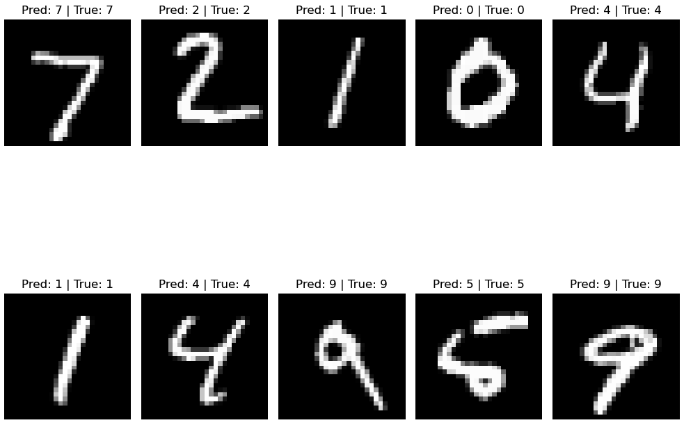
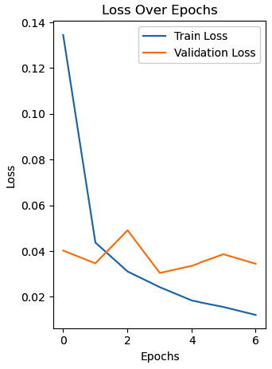

# Digit-Recognition

This project focuses on building and training a convolutional neural network (CNN) for digit recognition using the MNIST dataset. The goal is to classify handwritten digits (0-9) with high accuracy by leveraging deep learning techniques. The project uses Python, TensorFlow, and Keras to design and train the model, along with tools like Matplotlib for visualizing the results.

## Overview
The MNIST dataset consists of 60,000 training and 10,000 testing grayscale images of handwritten digits, each of size 28x28 pixels. The dataset is preprocessed by normalizing pixel values to a range of 0 to 1 and reshaping the images to fit the CNN input dimensions.

The CNN architecture includes:

- Convolutional Layers for feature extraction.
- MaxPooling Layers for dimensionality reduction.
- Dense Layers for classification.

## Tools and Libraries Used
- Deep Learning Framework: TensorFlow/Keras
- Visualization: Matplotlib
- Dataset: MNIST (handwritten digits dataset)
The model training process involves optimizing the categorical cross-entropy loss function using the Adam optimizer. Metrics like accuracy and loss are monitored during training to evaluate the model's performance.

